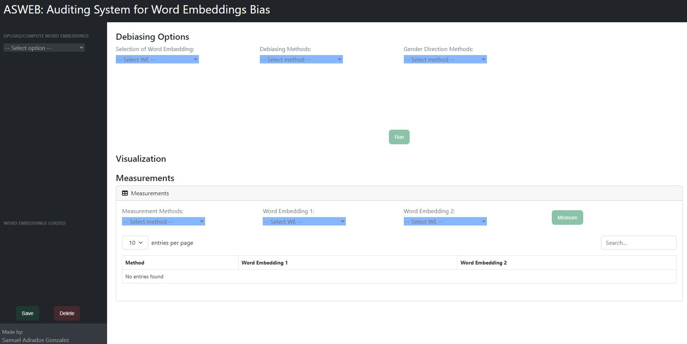
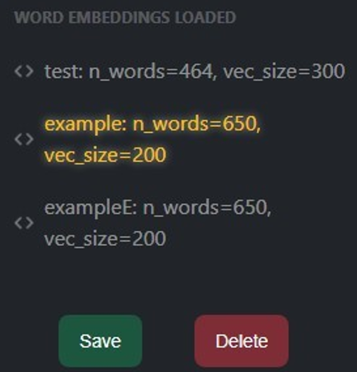
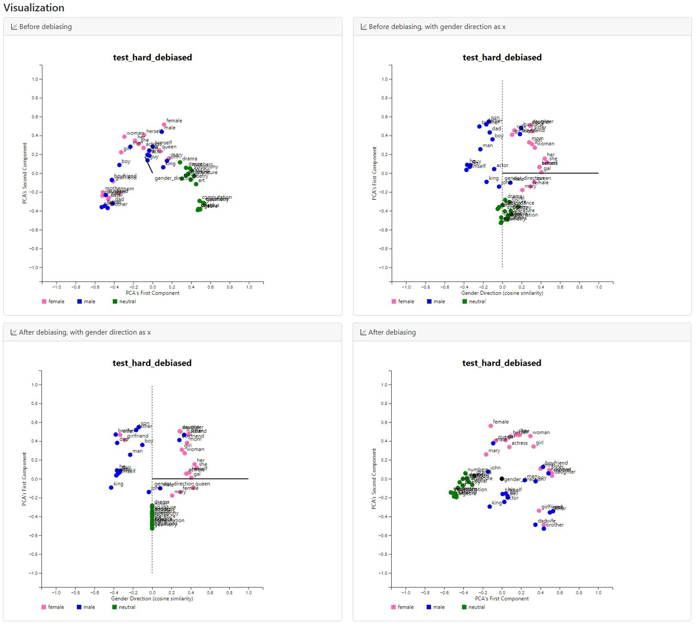
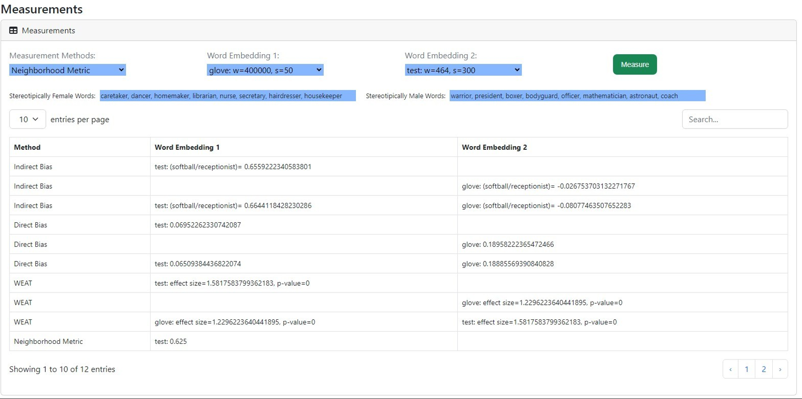
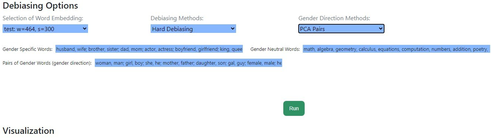

# ASWEB: Auditing System for Word Embeddings Bias

**ASWEB** is a comprehensive research ecosystem developed as part of a Master’s Thesis that received the **Award for the Best Master’s Thesis in Equality and Gender** (Grade: 9.5/10). The system is designed to track, quantify, and mitigate social biases within Natural Language Processing (NLP) models.



---

## 📸 Interface & Workflow

### 1. Flexible Data Management (Upload & Compute)
The system offers a dual approach to data handling via the **Upload/Compute** module.
* **Upload:** Supports ingestion of pre-trained embedding files (`.txt` format) with automatic validation.
* **Compute:** Users can train new models from scratch using raw corpora. The interface provides granular control over hyperparameters for **Word2Vec** (window size, min_count) and **GloVe**, executing backend training processes (`/compute_w2v`, `/compute_glove`) asynchronously.
* **Manager:** A dedicated sidebar ("Word Embeddings Loaded") allows for toggling, saving, and deleting active models.



### 2. Interactive Bias Visualization
Powered by **D3.js**, the tool renders 2D PCA projections to explore the topology of the vector space. Users can define the gender subspace using different strategies (**PCA Pairs** or **Two Means**) to visually confirm how neutral concepts (like professions) align with gendered axes before and after mitigation.


*2D projection showing gender bias in professions. Note how 'programmer' aligns with the male axis while 'homemaker' aligns with the female axis.*

### 3. Comprehensive Measurement Suite
The system goes beyond basic testing by implementing a multi-metric audit engine. The **Measurements** panel allows users to compare two models side-by-side (e.g., "Original" vs. "Debiased").
* **Metrics Included:** Direct Bias, Indirect Bias, WEAT (Word Embedding Association Test), and Neighborhood Metric.
* **Dynamic Reporting:** Results are displayed in a paginated, interactive table that lists effect sizes, p-values, and specific bias scores for the selected model pair.



### 4. Advanced Mitigation Engine (Debiasing)
A modular interface allows users to select and configure state-of-the-art debiasing algorithms.
* **Algorithms:** Hard Debiasing, Soft Debiasing, Attract-Repel, Linear Projection, Double-Hard Debiasing, and Iterative Nullspace Projection (INLP).
* **Customization:** Full control over hyperparameters (Lambda $\lambda$, Learning Rate, Epochs, Margins) and gender direction definition (PCA, Two Means, or Classification for INLP).
* **Workflow:** The "Run" function triggers the debiasing process on the backend and immediately visualizes the result for comparison.



## 📂 Project Structure

The repository is organized as follows:

```text
asweb/
├── 📂 data/
│   └── 📄 test_we.txt                # Sample embedding dataset
├── 📂 docs/                          # Documentation assets
│   ├── 🖼️ bias_visualization.png
│   ├── 🖼️ measurements.png
│   └── ...
├── 📂 src/                           # Core Research Library
│   ├── 🐍 __init__.py
│   ├── 🐍 debias.py                  # Mitigation algorithms (Hard/Soft, INLP)
│   ├── 🐍 files.py                   # I/O handling
│   ├── 🐍 gender_direction_search.py # PCA & Two-means logic
│   ├── 🐍 glove.py                   # GloVe model wrapper
│   ├── 🐍 measurements.py            # Audit metrics (WEAT, Direct Bias)
│   ├── 🐍 visualization.py           # PCA reduction & plotting logic
│   ├── 🐍 word_embeddings.py         # Base class for embeddings
│   └── 🐍 word2vec.py                # Word2Vec model wrapper
├── 📂 web/                           # Web Interface (Flask)
│   ├── 📂 static/
│   │   ├── 📂 assets/                # Images & Icons
│   │   ├── 📂 css/                   # Stylesheets
│   │   └── 📂 js/                    # Client-side logic (jQuery)
│   ├── 📂 templates/
│   │   └── 🌐 index.html             # Main dashboard template
│   └── 🐍 main.py                    # Flask entry point
├── 📜 LICENSE                        # MIT License terms (Legal protection)
├── 📝 README.md                      # Project documentation
├── ⚙️ requirements.txt               # Dependencies
└── 🐍 setup.py                       # Install script
```

## 🛠️ Installation & Usage

### Prerequisites
The system requires **Python 3.9+** and the deep learning dependencies listed in `requirements.txt`:

```bash
pip install -r requirements.txt
pip install -e .
```

## Running the System

To launch the interactive research dashboard, execute the following command from the project root:

```bash
python web/main.py
```

Access the application in your browser at http://localhost:5000.

## 🧪 Mathematical Foundation
The core logic of the system relies on manipulating the linear geometry of the vector space to ensure impartial decision-making. For methods like **Hard Debiasing**, the goal is to remove the projection of a word vector $w$ onto the bias subspace $B$:

$$w_{debiased} = \frac{w - \text{proj}_B(w)}{\|w - \text{proj}_B(w)\|}$$

This transformation ensures that neutral words are orthogonal to the gender direction, effectively neutralizing the bias while preserving semantic utility.

## 🎓 Academic Context & Citation

This software is the practical result of a Master's Thesis developed at the **University of Salamanca**, which received the **Award for the Best Master’s Thesis in Equality and Gender**.

**Author:** Samuel Adrados González  
**Supervisors:** Vivian Félix López Batista & Gabriel Villarrubia González  
**Department:** Departamento de Informática y Automática  
**Contact:** samuelon12@usal.es

If you use this toolkit in your research, please cite the original thesis:

> Adrados, S. (2023). *Auditing system to track, discover, and mitigate gender bias in Natural Language Processing systems*. MSc Thesis. University of Salamanca.

**BibTeX:**

```bibtex
@mastersthesis{adrados2023auditing,
  title={Auditing system to track, discover, and mitigate gender bias in Natural Language Processing systems},
  author={Adrados Gonz{\'a}lez, Samuel},
  school={University of Salamanca},
  year={2023},
  type={Master's Thesis},
  address={Salamanca, Spain},
  note={Supervisors: Vivian F{\'e}lix L{\'o}pez Batista and Gabriel Villarrubia Gonz{\'a}lez}
}

## 📜 License
This project is licensed under the MIT License - see the `LICENSE` file for details.
